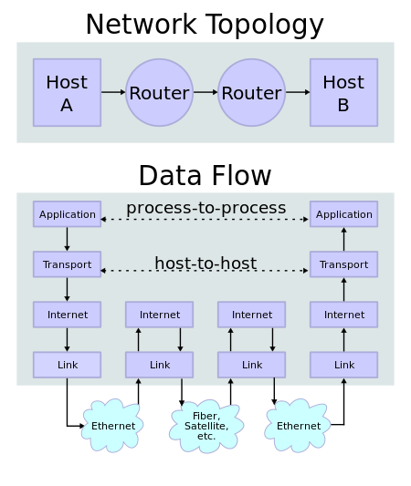
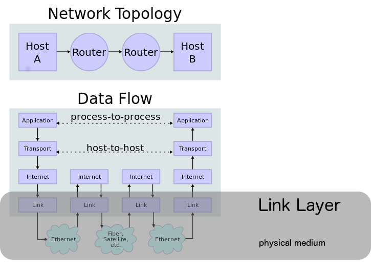

title: ETDG, Introduction to Networking
date: 2015-06-23
author:
    name: Ben Wallberg, Peter Eichman
    email: wallberg@umd.edu, peichman@umd.edu
output: index.html

--

### Introduction to Networking

UMD Libraries, Emerging Technologies Discussion Group

June 23, 2015

--

### Internet protocol suite

Many network models exist.  Today we will discuss the network
model used for The Internet, known as the Internet protocol suite.

https://en.wikipedia.org/wiki/Internet_protocol_suite

--

### Layer Model

A common way to build and understand complex computer systems is to create layers,
with each layer only needing to know its own implementation and how to
interact with an adjacent layer.
- Application layer
- Transport layer
- Internet layer
- Link layer

In the Internet model each layer only needs to understand itself and how to
interface with the next lower layer.

--

### Layer Model: Diagram

<table>
  <tr>
    <td></td>
    <td>
      [IP stack connections](http://commons.wikimedia.org/wiki/File:IP_stack_connections.svg)
       
      [CC BY-SA 3.0](http://creativecommons.org/licenses/by-sa/3.0/)
    </td>
  </tr>
</table>

--

### Link Layer

Link Layer

The link layer is used to move packets between the Internet layer
interfaces of two different hosts on the same link.  This layer may be
implemented on top of virtually any hardware networking technology.

https://en.wikipedia.org/wiki/Internet_protocol_suite#Link_layer

--

### Link Layer: Diagram

</td>

--

### Link Layer: Examples

Physical media: Ethernet, WiFi, 4G, Phone Line

Link: Network Interface Controller (NIC), Modem, Phone/Cell Antenna?

Media Access Control (MAC) Address

