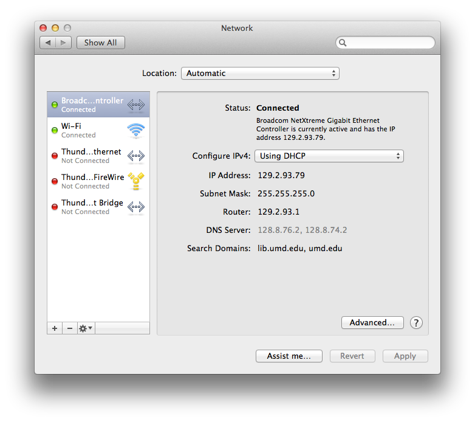

title: ETDG, Introduction to Networking
date: 2015-06-23
author:
    name: Ben Wallberg, Peter Eichman
    email: wallberg@umd.edu, peichman@umd.edu
output: index.html

--

### Introduction to Networking

UMD Libraries, Emerging Technologies Discussion Group

June 23, 2015

--

### Internet protocol suite

Many network models exist.  Today we will discuss the network
model used for The Internet, known as the Internet protocol suite.

https://en.wikipedia.org/wiki/Internet_protocol_suite

--

### Layer Model

A common way to build and understand complex computer systems is to create layers,
with each layer only needing to know its own implementation and how to
interact with an adjacent layer.

--

### Layer Model: Diagram

<table>
  <tr>
    <td></td>
    <td>
      [IP stack connections](http://commons.wikimedia.org/wiki/File:IP_stack_connections.svg)
      <br/>
      [CC BY-SA 3.0](http://creativecommons.org/licenses/by-sa/3.0/)
    </td>
  </tr>
</table>

--

### Layer Model: Levels

- Application layer
- Transport layer
- Internet layer
- Link layer

In the Internet model each layer only needs to understand itself and how to
interface with the next lower layer.

--

### Link Layer: Diagram


--

### Link Layer: Definition

The **link layer** is used to move packets between the Internet layer
interfaces of two different hosts on the same link.  This layer may be
implemented on top of virtually any hardware networking technology.

https://en.wikipedia.org/wiki/Internet_protocol_suite#Link_layer

--

### Link Layer: Examples

Physical interconnection: Ethernet, Phone Line, Cable, WiFi, 4G cell signal

Link endpoints: Network Interface Controller (NIC), Modem, Antenna

Networked devices are identified at the link layer by their Media Access Control
(MAC) Address (e.g., `80:e6:50:25:0d:74`)

--

### Link Layer: Exercise

Locate the MAC addresses for the WiFi NIC on your computer.

1. Open a Terminal
2. Type `ifconfig en0` at the prompt and press [Return]

--

### Link Layer: Ethernet Frame


[Ethernet Type II Frame format](https://commons.wikimedia.org/wiki/File:Ethernet_Type_II_Frame_format.svg)
<br/>
[Public Domain](https://en.wikipedia.org/wiki/en:public_domain)

--

### Link Layer: Exercise

Observe Ethernet frames, with Source and Destination MAC addresses

1. Open Wireshark, capture packets on en0
2. Inspect the Ethernet II elements

--

### Internet Layer: Diagram


--

### Internet Layer: Definition

The **internet layer** is responsibile for sending packets across potentially
multiple networks. Internetworking requires sending data from the source network
to the destination network. This process is called routing.

https://en.wikipedia.org/wiki/Internet_protocol_suite#Internet_layer

--

### Internet Layer: Examples

* Internet Protocol (IP)
* IP address
* Subnets
* Classless Inter-Domain Routing (CIDR)
* Routing
* Network Address Translation (NAT)
* Local Area Network (LAN)
* Wide Area Network (WAN)

--

### Internet Layer: Internet Protocol

The Internet Protocol (IP) is the principal communications protocol in the
Internet protocol suite for relaying datagrams across network boundaries. Its
routing function enables internetworking, and essentially establishes the
Internet.

https://en.wikipedia.org/wiki/Internet_Protocol

--

### Internet Layer: IP Address

A unique address for a computer on a network.

* Version 4 (**IPv4**) example: `192.168.192.125`
* 32 bits = 2³² = ~4.3 billion possible addresses
* Version 6 (**IPv6**) example: `fe80:4::82e6:50ff`
* 128 bits = 2¹²⁸ = ~3.4×10³⁸ possible addresses

--

### Internet Layer: Subnets

A subnetwork, or subnet, is a logical, visible subdivision of an IP network.
Computers that belong to a subnet are addressed with a common, identical, prefix
in their IP address.

* Address: 129.2.93.79
* Subnet prefix: 129.2.93
* Subnet mask: 255.255.255.0
* CIDR notation: 129.2.93.0/24

https://en.wikipedia.org/wiki/Subnetwork

--

### Internet Layer: Subnets



--

### Internet Layer: Exercise

Show subnets and IP addresses for all interfaces on your computer.

1. Open a Terminal
2. Type `netstat -i -n`

--

### Internet Layer: Routing

Traffic is exchanged (routed) between subnetworks with special gateways
(routers) when the routing prefixes of the source address and the destination
address differ.

Routers have a NIC for each network that they connect to, and a separate IP
address assigned to each NIC. One IP is their "public identity", visible to
other networks, and the other is their "private identity", visbile only to the
devices that are on the local subnet.

--

### Internet Layer: Exercise

Show what router to use to connect to specific IP address.

1. Open a Terminal
2. Type `route -n get www.lib.umd.edu -ifscope en0`

--

### Internet Layer: Exercise

Follow the route to the destination.

1. Open a Terminal
2. Type `traceroute -n -i en0 www.lib.umd.edu`
3. Type `traceroute -n -i en0 echodin.net`

--

### Transport Layer: Diagram


--

### Transport Layer: Definition

The **transport layer** establishes a basic data channel between hosts. It
provides end-to-end services that are independent of the underlying network
(link and internet layers).  These services are also independent of the
structure of user data and the logistics of exchanging information for any
particular specific purpose (application layer).

https://en.wikipedia.org/wiki/Internet_protocol_suite#Transport_layer

--

### Transport Layer: Examples

* User Datagram Protocol (UDP)
* Transmission Control Protocol (TCP)

Both operate on top of the IP protocol.  Due to the prevalence of TCP traffic the Internet protocol suite is also known as TCP/IP.

--

### Transport Layer: Examples

TCP and UDP both introduce the concept of port numbers (0-65535) to identify sending and receiving application end-points on a host.

Many applications have well known ports on the receiving end, eg. port 80 for web servers (HTTP). 

--

### Transport Layer: Examples

User Datagram Protocol (UDP) - used for simple, connectionless messaging transmissions

* Unreliable
* Unordered
* Lightweight, low latency
* Datagram (single packets)

https://en.wikipedia.org/wiki/User_Datagram_Protocol

--

### Transport Layer: Exercise

Observe UDP communications, using special interface Loopback (lo0) with IP address 127.0.0.1

1. Open Wireshark, capture packets on lo0, filter `udp.port eq 64000`
2. `netcat --udp --listen --local-port=64000` to listen for UDP datagrams on port 64000
4. `echo 'Hello, World' | netcat --udp 127.0.0.1 64000` to send "Hello, World" datagram


--

### Transport Layer: Examples

Transmission Control Protocol (TCP) - connection oriented, bi-directional messaging

* Reliable
* Ordered
* Heavyweight

https://en.wikipedia.org/wiki/Transmission_Control_Protocol

--

### Transport Layer: Exercise

Observe TCP communications, using Loopback interface

1. Open Wireshark, capture packets on lo0, filter `tcp.port eq 64000`
2. `netcat --tcp --listen --local-port=64000` to listen for TCP connections on port 64000
4. `echo 'Hello, World' | netcat --tcp --close 127.0.0.1 64000` to send "Hello, World" message

--

### Application Layer: Diagram


--

### Application Layer: Definition

The **application layer** includes the protocols for providing user services or
exchanging data over the network connections established by the lower level
protocols. Data coded according to application layer protocols is encapsulated
into transport layer protocol units (such as TCP or UDP messages), which in turn
use lower layer protocols to effect actual data transfer.

https://en.wikipedia.org/wiki/Internet_protocol_suite#Application_layer

--

### Application Layer: Examples

Domain Name System (DNS)

The Domain Name System is an essential component of the functionality of most Internet services because it is the Internet's primary directory service, translating domain names, which can be easily memorized by humans, to IP addresses.

https://en.wikipedia.org/wiki/Domain_Name_System

--

### Application Layer: Examples


--

### Application Layer: Exercise

Observe DNS communications.

1. Open Wireshark, capture packets on en0, filter `dns`
2. `nslookup lib.umd.edu`
3. `nslookup www.lib.umd.edu`
4. `nslookup oer.umd.edu`
5. `nslookup google.com`

--

### Application Layer: Examples

Hypertext Transfer Protocol (HTTP)

An application protocol for distributed, collaborative, hypermedia information systems; the foundation of data communication for the World Wide Web.

https://en.wikipedia.org/wiki/Hypertext_Transfer_Protocol

--

### Application Layer: Examples

HTTP Client Request

Requesting http://www.example.com/index.html

```
GET /index.html HTTP/1.1
Host: www.example.com
```

--

### Application Layer: Examples

HTTP Server Response:

```
HTTP/1.1 200 OK
Date: Mon, 23 May 2005 22:38:34 GMT
Server: Apache/1.3.3.7 (Unix) (Red-Hat/Linux)
Last-Modified: Wed, 08 Jan 2003 23:11:55 GMT
ETag: "3f80f-1b6-3e1cb03b"
Content-Type: text/html; charset=UTF-8
Content-Length: 138
Accept-Ranges: bytes
Connection: close
 
<html>
<head>
  <title>An Example Page</title>
</head>
<body>
  Hello World, this is a very simple HTML document.
</body>
</html>
```

--

### Application Layer: Exercise

Requesting http://lib.umd.edu/

Open Wireshark, capture packets on en0, filter `ip.addr eq 129.2.19.172 and tcp.port eq 80`

```
telnet lib.umd.edu
GET / HTTP/1.0
Host: lib.umd.edu

Ctrl-D
```

--

### Application Layer: Exercise

Requesting http://www.lib.umd.edu/

```
telnet www.lib.umd.edu
GET / HTTP/1.0
Host: lib.umd.edu

Ctrl-D
```

--

### Application Layer: Exercise

*curl* is a command-line tool to transfer data from or to a server, using one of the supported protocols (HTTP, etc.).  The command is designed to work without user interaction.

`curl http://lib.umd.edu`

--

### Application Layer: Exercise

Web development tools for inspection and debugging of web pages.

* Firebug - Firefox plugin
* Developer Tools - built-in to Chrome

--

### Application Layer: Examples

HTTP Secure (HTTPS)

HTTP communication within a connection encrypted by Transport Layer Security (TLS), et al. The main motivation for HTTPS is authentication of the visited website and to protect the privacy and integrity of the exchanged data.

https://en.wikipedia.org/wiki/HTTPS

--

### Application Layer: Exercise

Requesting https://mdsoar.org/

Open Wireshark, capture packets on en0, filter `ip.addr eq 129.2.19.141 and tcp.port eq 443`

`curl https://mdsoar.org/`

--

### Application Layer: Examples

Addtional examples:

* File Transmission Protocol (FTP)
* Secure Shell (SSH) protocol
* Simple Mail Transfer Protocol (SMTP)
